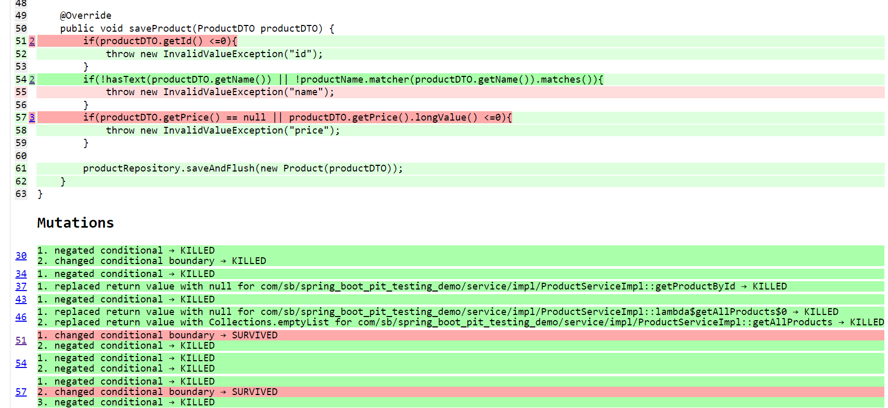

# spring-boot-pit-testing-demo
Demo project for pit testing against Spring Boot application


## Title: Unveiling Pit Testing: Enhancing Spring Boot Application Reliability**

### Introduction

In the realm of software development, ensuring the reliability and robustness of applications is paramount. Yet, despite our best efforts in writing test suites, vulnerabilities and blind spots can lurk within our code, waiting to manifest in unexpected ways. This is where pit testing emerges as a beacon of assurance, illuminating the efficacy of our testing endeavors with surgical precision.

In this digital age, where applications orchestrate the intricacies of modern life, the need for rigorous testing methodologies has never been more pressing. Traditional metrics like code coverage offer a glimpse into the extent of testing, but they often fall short in revealing the true resilience of our test suites. This is where pit testing, or mutation testing, steps into the spotlight, offering a deeper examination of our testing ecosystem.

In this blog post, we embark on a journey into the heart of pit testing, leveraging the power of a Spring Boot application as our guiding example. We'll unravel the mysteries of mutation testing, explore its significance in software development, and showcase its practical application in evaluating the reliability of Spring-based applications.

Our example Spring Boot application serves as the canvas upon which we paint our testing narrative. With service and repository classes/interfaces at its core, our application embodies the complexities and nuances of real-world software projects. Through the lens of pit testing, we'll dissect our test suite, identify its strengths and weaknesses, and emerge with newfound insights into our code's resilience.

Join us as we delve into the depths of pit testing, illuminating the path to enhanced application reliability and fortified testing practices. Together, we'll navigate the terrain of mutation testing, equip ourselves with the tools to scrutinize our test suites, and emerge as stewards of software quality in an ever-evolving digital landscape.

Let the journey begin.

### Overview of Spring Boot Application

In the world of Java-based web development, Spring Boot stands out as a powerful framework for building robust and scalable applications with minimal configuration. With its convention-over-configuration philosophy and extensive ecosystem of libraries, Spring Boot empowers developers to focus on building functionality rather than boilerplate code.

#### Example Application Structure

Let's consider a simplified e-commerce application as our example Spring Boot project. This application allows users to browse products, add them to a catalogue, and search specific product. Our application consists of several key components, including:

##### 1. Service Layer:
   The service layer contains business logic that orchestrates the flow of data and operations within the application. It encapsulates the core functionality of the application and interacts with other layers, such as the controller and repository layers. Here's an example of a service interface and its implementation:

   ```java
   // ProductService interface
   public interface ProductService {
       ProductDTO getProductById(Long productId);
       List<ProductDTO> getAllProducts();
       void saveProduct(ProductDTO product);
   }

   // ProductServiceImpl class
   @Service
   public class ProductServiceImpl implements ProductService {
       private final ProductRepository productRepository;

       private Pattern productName = Pattern.compile("^([0-9A-Za-z ]+)$");

       public ProductServiceImpl(ProductRepository productRepository) {
           this.productRepository = productRepository;
       }

       @Override
       public ProductDTO getProductById(Long productId) {
           if(productId<=0){
               throw new InvalidValueException("id");
           }
           Optional<Product> product = productRepository.findById(productId);
           if(!product.isPresent()){
               throw new NotFoundException(productId.toString());
           }
           return new ProductDTO(product.get());
       }

       @Override
       public List<ProductDTO> getAllProducts() {
           List<Product> products = productRepository.findAll();
           if(isEmpty(products)){
               throw new NotFoundException();
           }
           return products.stream().map(product -> new ProductDTO(product)).toList();
       }

       @Override
       public void saveProduct(ProductDTO productDTO) {
           if(productDTO.getId() <=0){
               throw new InvalidValueException("id");
           }
           if(!hasText(productDTO.getName()) || !productName.matcher(productDTO.getName()).matches()){
               throw new InvalidValueException("name");
           }
           if(productDTO.getPrice() == null || productDTO.getPrice().longValue() <=0){
               throw new InvalidValueException("price");
           }

           productRepository.saveAndFlush(new Product(productDTO));
       }
   }
   ```

##### 2. Repository Layer
   The repository layer is responsible for interacting with the database or other data sources. It provides CRUD (Create, Read, Update, Delete) operations for accessing and manipulating data entities. Here's an example of a repository interface:

   ```java
   // ProductRepository interface
   public interface ProductRepository extends JpaRepository<Product, Long> {
   }
   ```

   In this example, we're using Spring Data JPA, which provides convenient abstractions for working with relational databases.

##### 3. Controller Layer

The controller layer in a Spring Boot application is responsible for handling incoming HTTP requests, processing them, and returning appropriate responses to clients. It acts as an intermediary between the client (e.g., web browser, mobile app) and the service layer, orchestrating the flow of data and operations within the application.

Here's an example of a controller class for our e-commerce application:

```java
@RestController
@RequestMapping("/products")
public class ProductController {
    private final ProductService productService;

    public ProductController(ProductService productService) {
        this.productService = productService;
    }

    @GetMapping("/{productId}")
    @ResponseStatus(HttpStatus.OK)
    public ProductDTO getProductById(@PathVariable Long productId) {
        ProductDTO productDTO = productService.getProductById(productId);
        return productDTO;
    }

    @GetMapping
    @ResponseStatus(HttpStatus.OK)
    public List<ProductDTO> getAllProducts() {
        List<ProductDTO> products = productService.getAllProducts();
        return products;
    }

    @PostMapping
    @ResponseStatus(HttpStatus.NO_CONTENT)
    public void saveProduct(@RequestBody ProductDTO productDTO) {
        productService.saveProduct(productDTO);
    }
}
```

In this example, we define a `ProductController` class with various endpoint mappings for handling HTTP GET and POST requests related to products. Each method delegates the request processing to corresponding methods in the `ProductService` class, and the controller returns appropriate responses based on the results.

##### 5. Model Layer

The model layer in a Spring Boot application comprises data entities that represent the application's domain. These entities define the structure of the application's data and are typically mapped to database tables in a relational database management system (RDBMS).

Here's an example of a `Product` entity class for our e-commerce application:

```java
@Entity
@Table(name = "products")
public class Product {
    @Id
    @GeneratedValue(strategy = GenerationType.IDENTITY)
    private Long id;

    @Column(nullable = false)
    private String name;

    @Column(nullable = false)
    private BigDecimal price;
}
```

In this example, we define a `Product` entity class using JPA annotations (`@Entity`, `@Table`, `@Id`, `@GeneratedValue`, `@Column`) to specify its mapping to a database table named "products". The `Product` class has attributes such as `id`, `name`, and `price`, representing the properties of a product.

### 5. Adding Tests to the Spring Boot Application

Testing is an integral part of the software development process, ensuring that our code behaves as expected and remains reliable in various scenarios. In this section, we'll discuss the importance of testing in a Spring Boot application and demonstrate how to write comprehensive test cases for our example application's service and repository layers.

#### Importance of Testing in Spring Boot

Before diving into writing tests, let's briefly underscore the significance of testing in a Spring Boot application. Testing allows us to validate the correctness of our code, catch bugs early in the development cycle, and ensure that new changes do not introduce regressions. By adopting a test-driven development (TDD) approach, we can foster a culture of quality and confidence in our codebase.

#### Writing Tests for Service Layer

The service layer contains the business logic of our application, making it crucial to thoroughly test its behavior. We'll write unit tests for our `ProductService` class to verify that it correctly interacts with the `ProductRepository` and implements the desired functionality.

Here's an example of a JUnit test class for the `ProductService`:

```java
@ExtendWith(MockitoExtension.class)
public class ProductServiceImplTest extends Assertions {

    @Mock
    private ProductRepository productRepository;

    private ProductServiceImpl productService;

    @BeforeEach
    public void setUp() {
        MockitoAnnotations.initMocks(this);
        productService = new ProductServiceImpl(productRepository);
    }

    @Test
    public void testGetProductById_InvalidId() {
        assertThrows(InvalidValueException.class, () -> productService.getProductById(0L));
    }

    @Test
    public void testGetProductById_ProductNotFound() {
        when(productRepository.findById(anyLong())).thenReturn(Optional.empty());

        assertThrows(NotFoundException.class, () -> productService.getProductById(1L));
    }

    @Test
    public void testGetProductById_Success() {
        Product product = new Product();
        product.setId(1L);
        when(productRepository.findById(anyLong())).thenReturn(Optional.of(product));

        ProductDTO result = productService.getProductById(2L);

        assertEquals(1L, result.getId());
    }

    @Test
    public void testGetAllProducts_NoProductsFound() {
        when(productRepository.findAll()).thenReturn(new ArrayList<>());

        assertThrows(NotFoundException.class, () -> productService.getAllProducts());
    }

    @Test
    public void testGetAllProducts_Success() {
        List<Product> products = new ArrayList<>();
        Product product1 = new Product();
        product1.setId(1L);
        products.add(product1);
        Product product2 = new Product();
        product2.setId(2L);
        products.add(product2);
        when(productRepository.findAll()).thenReturn(products);

        List<ProductDTO> result = productService.getAllProducts();

        assertEquals(2, result.size());
        assertEquals(1L, result.get(0).getId());
        assertEquals(2L, result.get(1).getId());
    }

    @Test
    public void testSaveProduct_InvalidId() {
        ProductDTO productDTO = new ProductDTO();
        productDTO.setId(0L);

        assertThrows(InvalidValueException.class, () -> productService.saveProduct(productDTO));
    }

    @Test
    public void testSaveProduct_InvalidName() {
        ProductDTO productDTO = new ProductDTO();
        productDTO.setId(1L);
        productDTO.setName("123");

        assertThrows(InvalidValueException.class, () -> productService.saveProduct(productDTO));
    }

    @Test
    public void testSaveProduct_NullPrice() {
        ProductDTO productDTO = new ProductDTO();
        productDTO.setId(1L);
        productDTO.setName("Test Product");

        assertThrows(InvalidValueException.class, () -> productService.saveProduct(productDTO));
    }

    @Test
    public void testSaveProduct_NegativePrice() {
        ProductDTO productDTO = new ProductDTO();
        productDTO.setId(1L);
        productDTO.setName("Test Product");
        productDTO.setPrice(BigDecimal.valueOf(-10));

        assertThrows(InvalidValueException.class, () -> productService.saveProduct(productDTO));
    }

    @Test
    public void testSaveProduct_Success() {
        ProductDTO productDTO = new ProductDTO();
        productDTO.setId(1L);
        productDTO.setName("Test Product");
        productDTO.setPrice(BigDecimal.TEN);

        productService.saveProduct(productDTO);

        verify(productRepository, times(1)).saveAndFlush(any(Product.class));
    }
}
```


#### Running Tests

To run the tests, you can execute the test classes using your IDE's testing support or use Maven or Gradle commands (`./gradlew test`). Ensure that all tests pass without errors or failures, indicating that the application behaves as expected.

By writing comprehensive tests for our Spring Boot application, we can validate its behavior, catch potential bugs early, and maintain confidence in its reliability throughout the development process.


### Introduction to Mutation Testing with PIT

In the realm of software testing, ensuring the effectiveness of test suites is essential for maintaining the reliability and robustness of applications. While traditional testing methods such as unit testing and code coverage analysis provide valuable insights into the quality of test suites, they often fall short in uncovering subtle defects and vulnerabilities lurking within the codebase. This is where mutation testing emerges as a powerful technique for evaluating the thoroughness of test suites and identifying areas for improvement.

#### What is Mutation Testing?

Mutation testing is a technique used to assess the quality of test suites by introducing small changes, or mutations, into the source code and measuring the ability of tests to detect these changes. The fundamental idea behind mutation testing is to simulate potential defects or errors in the code and observe how well the test suite detects and reports these mutations. A high mutation score indicates that the test suite is effective in identifying defects, while a low score suggests areas of weakness that require further attention.

#### Introducing PIT

PIT (Project, Integration, Test) is a widely-used mutation testing tool for Java projects. It operates at the bytecode level, making it language-agnostic and compatible with any JVM-based language, including Java and Kotlin. PIT analyzes the source code of a project, introduces mutations based on predefined mutation operators, and runs the test suite against these mutated versions of the code to evaluate test coverage and effectiveness.

**Example of Mutation Testing with PIT:**

Let's illustrate the concept of mutation testing with a simple Java method and corresponding test case. Consider the following Java method that validates input fields of Product before saving it:


```java
public class ProductServiceImpl implements ProductService {
    .............
    @Override
    public void saveProduct(ProductDTO productDTO) {
        if (productDTO.getId() <= 0) {
            throw new InvalidValueException("id");
        }
        if (!hasText(productDTO.getName()) || !productName.matcher(productDTO.getName()).matches()) {
            throw new InvalidValueException("name");
        }
        if (productDTO.getPrice() == null || productDTO.getPrice().longValue() <= 0) {
            throw new InvalidValueException("price");
        }

        productRepository.saveAndFlush(new Product(productDTO));
    }
}
```

Now, let's write some JUnit test case for the `saveProduct` method to ensure its correctness:

```java
@ExtendWith(MockitoExtension.class)
public class ProductServiceImplTest{
    @Test
    public void testSaveProduct_InvalidId() {
        ProductDTO productDTO = new ProductDTO();
        productDTO.setId(0L);

        assertThrows(InvalidValueException.class, () -> productService.saveProduct(productDTO));
    }

    @Test
    public void testSaveProduct_InvalidName() {
        ProductDTO productDTO = new ProductDTO();
        productDTO.setId(1L);
        productDTO.setName("123");

        assertThrows(InvalidValueException.class, () -> productService.saveProduct(productDTO));
    }

    @Test
    public void testSaveProduct_NullPrice() {
        ProductDTO productDTO = new ProductDTO();
        productDTO.setId(1L);
        productDTO.setName("Test Product");

        assertThrows(InvalidValueException.class, () -> productService.saveProduct(productDTO));
    }

    @Test
    public void testSaveProduct_NegativePrice() {
        ProductDTO productDTO = new ProductDTO();
        productDTO.setId(1L);
        productDTO.setName("Test Product");
        productDTO.setPrice(BigDecimal.valueOf(-10));

        assertThrows(InvalidValueException.class, () -> productService.saveProduct(productDTO));
    }

    @Test
    public void testSaveProduct_Success() {
        ProductDTO productDTO = new ProductDTO();
        productDTO.setId(1L);
        productDTO.setName("Test Product");
        productDTO.setPrice(BigDecimal.TEN);

        productService.saveProduct(productDTO);

        verify(productRepository, times(1)).saveAndFlush(any(Product.class));
    }
}
```

To perform mutation testing using PIT, we would configure PIT within our project's build configuration (e.g. Gradle) and run the mutation analysis. PIT would then introduce mutations into the `ProductServiceImpl` class, such as changing the `return productDTO;` statement to `return null;` or modifying the conditional expression `productDTO.getId() <=0` to `productDTO.getId() <=1`, and assess whether the test suite detects these mutations.

By analyzing the mutation score and detailed mutation reports generated by PIT, developers can gain insights into the effectiveness of their test suites and identify areas where additional tests or improvements are needed.


### Integrate PITEST

Integrating PIT (Project, Integration, Test) into a Gradle project allows for mutation testing, evaluating the effectiveness of your test suite in detecting code mutations. Below are the steps to configure PIT in your Gradle project:

#### Step 1: Add PIT Gradle Plugin

Start by adding the PIT Gradle plugin to your project's `build.gradle` file. This plugin allows configuration and execution of mutation testing during the build process.

```groovy
plugins {
    id 'info.solidsoft.pitest' version '1.15.0'
}
```

#### Step 2: Configure PIT Options (Optional)

You can configure PIT options within the `pitest` block in your `build.gradle` file. Some common configuration options include:

- `targetClasses`: Specify the classes/packages to be mutated. By default, PIT mutates all classes in the project.
- `targetTests`: Specify the test classes/packages to be executed during mutation testing. By default, PIT runs all test classes in the project.
- `mutators`: Customize the mutation operators used by PIT. You can specify specific mutation operators or exclude certain operators.
- `reports`: Define the formats of the mutation testing reports generated by PIT (e.g., HTML, XML, CSV).

Here's an example of configuring PIT options in `build.gradle`:

```groovy
pitest {
    targetClasses = ['com.sb.spring_boot_pit_testing_demo.*']  //by default "${project.group}.*"
    pitestVersion = '1.15.0' //not needed when a default PIT version should be used
    reports {
        html.enabled = true
        xml.enabled = true
    }
    threads = 4
    outputFormats = ['XML', 'HTML']
    timestampedReports = false
    junit5PluginVersion = '1.2.1'
    
}
```

Refer to the PIT documentation for a comprehensive list of configuration options and their usage.

#### Step 3: Run Mutation Testing

Once you've added the PIT plugin and configured options, you can run mutation testing using the following Gradle command:

```
./gradlew pitest
```

This command executes mutation testing on your project and generates mutation testing reports based on the configured options.

#### Step 4: Review Mutation Testing Reports

After mutation testing completes, PIT generates mutation testing reports that provide insights into the effectiveness of your test suite in detecting code mutations. You can find the reports in the `build/reports/pitest` directory of your project.

The Report will look like 


#### Step 5: Refine Tests Based on Results

Based on the mutation testing reports, identify areas where your test suite could be improved to detect more mutations. Consider adding additional test cases, enhancing existing tests, or addressing gaps in test coverage to increase the mutation score and strengthen the reliability of your codebase.

Above report depicts that for current validations it has flagged two survivals for boundary conditions. It means changing the `productDTO.getId() <=0` and `productDTO.getPrice() == null || productDTO.getPrice().longValue() <=0` conditions has survived our tests. According to pit mutation at least one test case should be failed. So we need to add some more test cases to fix Survivals.

#### Step 6: Fixing survivals


#### Step 6: Integration with Continuous Integration (CI) Pipeline (Optional):**

For seamless integration with your CI pipeline, consider configuring mutation testing as part of your automated build process. Incorporate the `pitest` task into your CI configuration to automatically run mutation testing whenever code changes are pushed to your repository.

By integrating PIT into your Gradle project, you can gain valuable insights into the effectiveness of your test suite and identify areas for improvement, ultimately enhancing the reliability and robustness of your software.

--- 

Integrating PIT into your Gradle project empowers you to perform mutation testing and evaluate the effectiveness of your test suite in detecting code mutations. Follow these steps to configure PIT and run mutation testing in your Gradle project, paving the way for improved code quality and reliability.


Running mutation testing with PIT (Project, Integration, Test) involves configuring PIT in your project and executing the mutation analysis to evaluate the effectiveness of your test suite in detecting code mutations. Below are the steps to run mutation testing with PIT:

**Step 1: Configuration:**

Ensure that PIT is integrated into your project either through Maven or Gradle as described in the previous sections. Make sure the necessary dependencies and configurations are added to your project's build configuration file (`pom.xml` for Maven or `build.gradle` for Gradle).

**Step 2: Define PIT Options (Optional):**

Customize the mutation testing options in your project configuration file to specify the scope of mutation testing, including target classes, test classes, mutation operators, and report formats. Refer to the PIT documentation for a comprehensive list of configuration options and their usage.

**Step 3: Execute Mutation Testing:**

Once the configuration is set up, you can execute mutation testing using the appropriate Maven or Gradle command:

- **Maven:**
  ```
  mvn org.pitest:pitest-maven:mutationCoverage
  ```

- **Gradle:**
  ```
  ./gradlew pitest
  ```

**Step 4: Analyze Mutation Testing Reports:**

After mutation testing completes, PIT generates mutation testing reports that provide insights into the effectiveness of your test suite in detecting code mutations. These reports typically include metrics such as mutation score, mutation coverage, and details of detected mutations.

Review the reports to identify areas where your test suite could be improved to detect more mutations. Analyze the mutation score to assess the overall effectiveness of your test suite in detecting code changes and potential defects.

**Step 5: Refine Tests Based on Results:**

Based on the mutation testing reports, refine your test suite to improve its effectiveness in detecting code mutations. Consider adding additional test cases, enhancing existing tests, or addressing gaps in test coverage to increase the mutation score and strengthen the reliability of your codebase.

**Step 6: Integration with Continuous Integration (CI) Pipeline (Optional):**

For seamless integration with your CI pipeline, configure mutation testing as part of your automated build process. Incorporate the mutation testing task into your CI configuration to automatically run mutation testing whenever code changes are pushed to your repository.

By integrating mutation testing with PIT into your project, you can gain valuable insights into the effectiveness of your test suite and identify areas for improvement, ultimately enhancing the reliability and robustness of your software.

---

Running mutation testing with PIT allows you to evaluate the effectiveness of your test suite in detecting code mutations and identifying areas for improvement in your tests. Follow these steps to execute mutation testing with PIT and enhance the quality and reliability of your software.

Interpreting the results of mutation testing with PIT is crucial for understanding the effectiveness of your test suite and identifying areas for improvement in your tests. Below are some key aspects to consider when interpreting the results of mutation testing:

**1. Mutation Score:**
- The mutation score indicates the percentage of code mutations detected by your test suite.
- A higher mutation score suggests a more effective test suite, as it indicates that a greater proportion of code mutations were detected.
- Aim for a mutation score as close to 100% as possible, indicating that your test suite effectively detects most code mutations.

**2. Mutation Coverage:**
- Mutation coverage measures the percentage of code that was subjected to mutation testing.
- It indicates how thoroughly your codebase was tested for potential defects through mutation testing.
- Analyze mutation coverage alongside mutation score to ensure that your test suite adequately covers all code paths and functionalities.

**3. Detected Mutations:**
- Review the details of detected mutations to understand the specific types of code changes that were introduced and whether they were correctly detected by your test suite.
- Identify patterns or common types of mutations that were not adequately detected, as these may indicate weaknesses in your test suite.

**4. Uncovered Mutations:**
- Pay attention to mutations that were not detected by your test suite, as these represent potential areas of weakness in your tests.
- Analyze the reasons why certain mutations were not detected, such as insufficient test coverage, ineffective test assertions, or gaps in test scenarios.

**5. Mutation Operators:**
- Mutation testing applies various mutation operators to introduce code changes, such as changing arithmetic operations, logical expressions, or method invocations.
- Evaluate the effectiveness of your test suite in detecting mutations introduced by different mutation operators.
- Identify mutation operators that were not adequately detected by your tests and consider enhancing your test suite to cover these scenarios.

**6. Test Suite Effectiveness:**
- Assess the overall effectiveness of your test suite in detecting code mutations and potential defects.
- Identify strengths and weaknesses in your test suite and prioritize improvements based on the impact on mutation score and coverage.

**7. Iterative Improvement:**
- Mutation testing results provide valuable feedback for iteratively improving your test suite over time.
- Use the insights gained from mutation testing to refine your test cases, enhance test coverage, strengthen assertions, and address gaps in test scenarios.

**8. Continuous Monitoring:**
- Integrate mutation testing into your continuous integration (CI) pipeline to monitor the effectiveness of your test suite on an ongoing basis.
- Regularly analyze mutation testing reports and incorporate feedback into your development process to maintain and improve the quality of your software.

By carefully interpreting the results of mutation testing with PIT, you can gain valuable insights into the effectiveness of your test suite, identify areas for improvement in your tests, and enhance the reliability and robustness of your software over time.


In conclusion, integrating mutation testing with PIT (Project, Integration, Test) into your Spring Boot project provides valuable insights into the effectiveness of your test suite and helps identify areas for improvement in your tests. Through the process of mutation testing, you can assess the reliability and robustness of your codebase by simulating various code mutations and evaluating how well your tests detect these changes.

By interpreting the results of mutation testing, including the mutation score, mutation coverage, detected mutations, and uncovered mutations, you can gain a deeper understanding of the strengths and weaknesses of your test suite. This information enables you to iteratively improve your test cases, enhance test coverage, strengthen assertions, and address gaps in test scenarios, ultimately leading to higher-quality software.

Continuously monitoring mutation testing results and integrating mutation testing into your CI pipeline allows for ongoing assessment and refinement of your test suite, ensuring that your software remains reliable and resilient to code changes over time.

Incorporating mutation testing as part of your development process empowers you to foster a culture of quality and confidence in your codebase, resulting in more robust and dependable software solutions. By leveraging mutation testing with PIT, you can enhance the reliability, maintainability, and overall quality of your Spring Boot applications.
